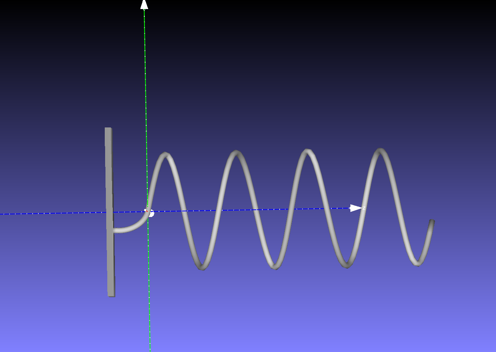
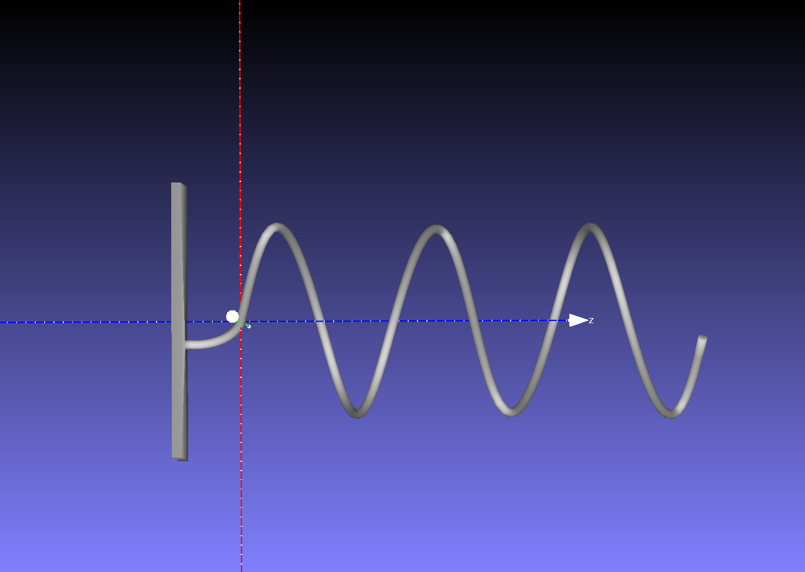

## 教育的側面

教育分野においても、このプロジェクトは非常に大きな効果を発揮すると考えている

- 変化の感覚的理解
    - 物理学における物体の軌跡、数学における関数のグラフの変化など、時間に代表される $x$, $y$ と異なる量と共に変化する複雑な概念を、より感覚的に親しみ, 新しい角度からの発見を促す
    - 例
        - リサージュ図形
            - $x, y, z (= \theta)$ の異なる視点から見ることで, リサージュ図形が周期が異なるサイン波からできていることが視覚的にわかる
            - 
            - 
            - 
        - 惑星の公転軌道
- 創造性の育成
    - ユーザー自身がルールを設定し, 3Dオブジェクトを観察し, 試行錯誤することで創造的な思考力を養うことができる
    - ワークショップなど「好きな関数を立体にしてみよう!」
