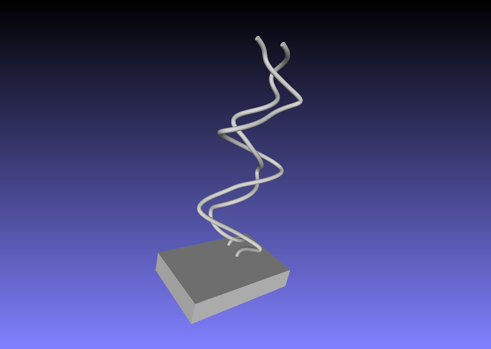
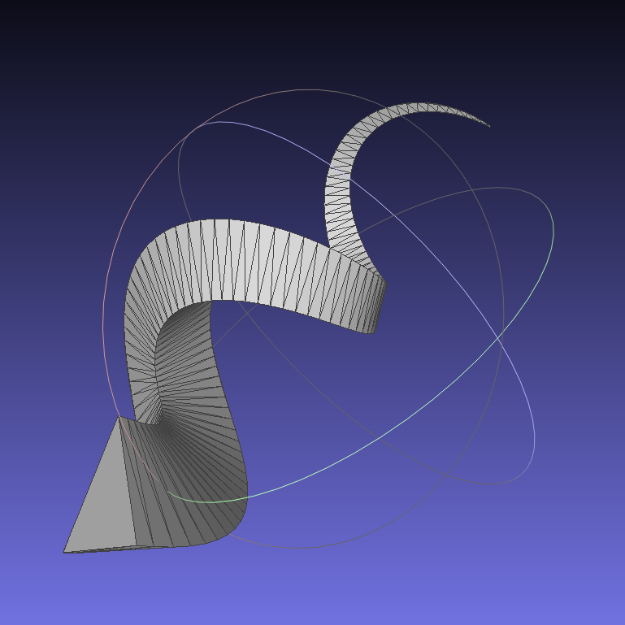
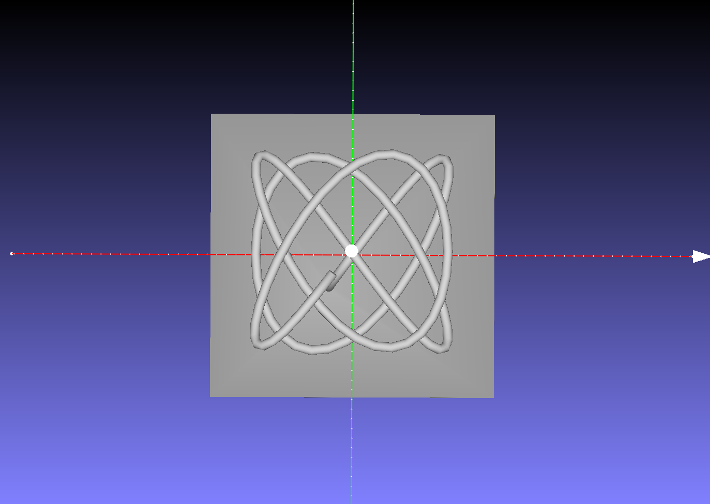

## 概要

2Dの「変化する」対象の時間的推移をプロットし, 3Dで可視化する作品またはその処理を行うソフトウェア

1. 映像またはシミュレーションから 2D 座標の点の系列を取得する
2. その図形を時間方向に「重ねた」立体図形を構成し, 3Dモデルを構成する

## 本作品の特徴

- [芸術的側面](./art_side.md)
- [技術的側面](./tech_side.md)
- [教育的側面](./edu_side.md)

## 今後の展望
- 映像からの3Dモデルの作成
    - 群集の動きを写した映像からの生成
        - Multi Object Tracking の利用
- 併合する対象についての処理

## ギャラリー

