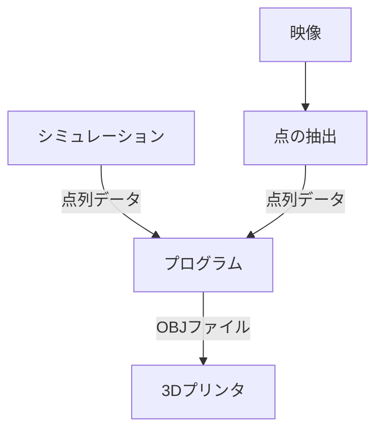

## 技術的側面

### フロー
映像やシミュレーションから点を計算し, プログラムがそのデータをもとに 3D モデルを作成し, OBJ 形式のファイルを作成する.

## モデルの作り方の種類

1. `LayerObj3D`
    - 2D の点集合をそれぞれのステップで用意し, 対応する点をつないで側面を作る
    - 一番単純な方法
    - 変位が小さく, 離散的な対象に向いている
    - 課題:
        - 回転する対象への対策
            - ねじれた立体は3Dプリントする際に不安定
            - 点の追加の割合で

2. `TraceCurveObj3D`

## 幾何的処理

