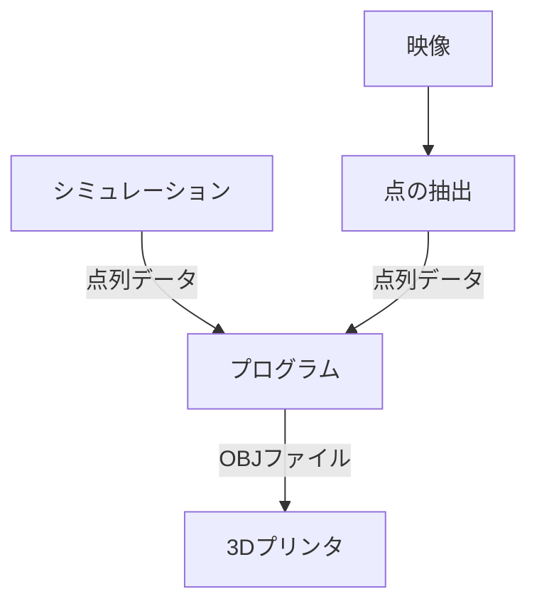

## 技術的側面

### フロー
映像やシミュレーションから点を計算し, プログラムがそのデータをもとに 3D モデルを作成し, OBJ 形式のファイルを作成する.



## モデルの作り方の種類

対象に合わせて2つの方法を考える.

1. `LayerObj3D`
    - 2D の点集合をそれぞれのステップで用意し, 対応する点をつないで側面を作る
    - 一番単純な方法
    - 変位が小さく, 断面を正確に指定したい対象に向いている
    - 課題:
        - 回転する対象への対策
            - ねじれた立体は3Dプリントする際に不安定
            - 点の追加の割合で
        - 変位が大きい対象では, 太さが足りない
            <!-- 画像 -->
            - => `TraceCurveObj3D` を用いる
    - 適している対象の例
        - ラングトンのアリ
            - アリの向きを再現したいので, `LayerObj3D` を用いた
2. `TraceCurveObj3D`
    - 中心の点をトレースする
    - その軌跡を「太らせる」ことでモデルを構成する
    - 正確な断面の再現は不向き
    - 課題
        - 急激なカーブでの自己交差
            - 小規模の自己交差については中心点を少しずらす
            <!-- 画像 -->
            - ワイヤーの半径を手動で調整
    - 適している対象の例
        - 二重振り子
3. `MultiObj3D`
    - 複数の `LayerObj3D`, `TraceCurveObj3D` を土台でつなげて同時に表現する
    - `TraceCurveObj3D` は土台の方向に端を曲げることでプリントした時の強度を増やす
    <!-- 画像 -->

## 幾何的処理

### 軌跡を「太らせる」処理
ベクトル $\boldsymbol{n}$ ($|\boldsymbol{n}| = 1$) に対して, これを法線とする平面に2Dの座標 $(p_x, p_y)$ をマッピングする.
1. $\boldsymbol{n}$ と平行でない長さ$1$ の適当なベクトル $\boldsymbol{t}$ を用意する
2. $\boldsymbol{u} := \boldsymbol{t} \times \boldsymbol{n}$ とし, $\boldsymbol{u}$ の長さを $1$ にする
3. $\boldsymbol{v} := \boldsymbol{t} \times \boldsymbol{n}$ とし, $\boldsymbol{v}$ の長さを $1$ にする
4. $p_x \boldsymbol{u} + p_y \boldsymbol{v}$ を対応する点とする

$\boldsymbol{t}$ の取り方について, 最初は $\boldsymbol{t} = (0, 1, 0)$ として, ほぼ平行だったら$(0, 0, 1)$ に切り替える.
2回目以降は直前の $\boldsymbol{v}$ を $\boldsymbol{t}$ として使うと, 直前に作った平面とつないだ時に自然な座標が得られる.

### オブジェクトの端を指定の方向に曲げる

曲げる方向を表すベクトルを $\boldsymbol{u}$, 今の面の法線ベクトルを $\boldsymbol{n}$ とする.
それぞれ $|\boldsymbol{u}| = |\boldsymbol{n}| = 1$とする.

$\boldsymbol{u}$ に独立な方向 $\boldsymbol{v}$ を定め, $\boldsymbol{u}$ と $\boldsymbol{v}$ に成分分解をして, それを回転行列によって更新する.
これによって $\boldsymbol{u}, \boldsymbol{v}$ によって張られる平面に沿って曲げることができる.

以下を繰り返す:
1. $u := \boldsymbol{u} \cdot \boldsymbol{n}$
2. if $|u - 1| \lt \varepsilon$: break
3. $\boldsymbol{v} := \boldsymbol{n} - u \boldsymbol{u}$, $\boldsymbol{v}$ の長さを $1$ にする.
4. $v := \boldsymbol{v} \cdot \boldsymbol{n}$
5. $(u', v')^T := M (u, v)^T$, $M$ は回転行列.
6. $\boldsymbol{n} := u' \boldsymbol{u} + v' \boldsymbol{v}$,  $\boldsymbol{n}$ の長さを $1$ にする.

最終的な $\boldsymbol{n}$ が新しい面の法線ベクトルとなる.
$M$ は以下のような行列で, $\boldsymbol{n}$ を $\boldsymbol{u}$ の方向に $\theta$ だけ回転する:
```math
M := \begin{bmatrix}
    \cos\theta & \sin\theta \\
    -\sin\theta & \cos\theta
  \end{bmatrix}
```

